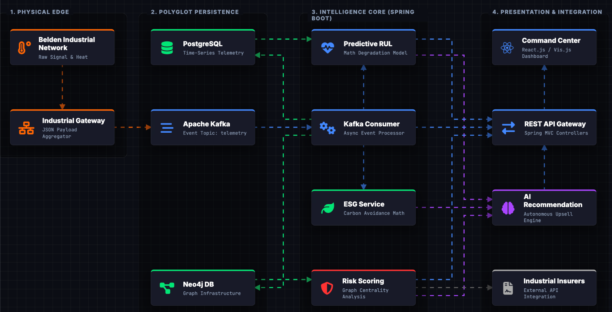

<div align="center">

# ⚡ Horizon – Smart Cable Health & Topology Dashboard

### *Predictive Maintenance & Risk Intelligence for Industrial Cable Networks*

[](https://spring.io/projects/spring-boot)
[](https://react.dev/)
[](https://neo4j.com/)
[](https://kafka.apache.org/)
[](https://postgresql.org/)

<p align="center">
  
  
  
</p>

---

**Horizon** is a full-stack predictive maintenance platform that models industrial cable topology using graph databases, processes real-time telemetry streams, calculates Remaining Useful Life (RUL), and provides actionable AI-style maintenance recommendations — all visualized in a modern interactive dashboard.

🚀 Designed as a **production-grade proof-of-concept** for smart factories and Industry 4.0 environments.

</div>

---

# ✨ Core Capabilities

<table>
<tr>
<td width="50%">

## 🏭 Factory Intelligence

| Feature | Description |
|----------|-------------|
| 🔗 **Graph Topology** | Factory cables, switches, machines & assembly lines in Neo4j |
| ⚡ **Impact Simulation** | Identify affected assembly lines on cable failure |
| 📉 **Degradation Modeling** | Simulates progressive cable wear |
| 📡 **Live Telemetry Ingestion** | Temperature, attenuation & load metrics |

</td>
<td width="50%">

## 📊 Predictive Analytics

| Feature | Description |
|----------|-------------|
| 🧮 **RUL Calculation** | Remaining Useful Life projection |
| 🚨 **Risk Scoring** | Composite risk based on topology & health |
| 🌱 **Carbon Metrics** | Sustainability impact calculation |
| 🤖 **Recommendation Engine** | Business-rule-based maintenance suggestions |

</td>
</tr>
</table>

---

# 🧠 System Architecture
<p align="center">
  
</p>

### 🔄 Event-Driven Pipeline

1. Telemetry is produced via REST or Simulator
2. Events are published to Kafka
3. Consumer processes health & RUL
4. Data persisted in PostgreSQL
5. Graph relationships updated in Neo4j
6. Dashboard aggregates and visualizes metrics

---

# 🖥️ Dashboard Features

| Module             | Description                               |
| ------------------ | ----------------------------------------- |
| 📊 Health Chart    | Last 20 telemetry readings                |
| 🌐 Topology Graph  | Interactive cable → switch → machine view |
| ⚠️ Risk Panel      | Color-coded composite risk score          |
| 🌱 Sustainability  | Carbon footprint estimation               |
| 📝 Recommendations | AI-style actionable suggestions           |
| 🔔 Alerts          | Console logs for critical cable states    |

---

# 🛠️ Tech Stack

<div align="center">

| Layer             | Technology              |
| ----------------- | ----------------------- |
| **Frontend**      | React, Vite, vis.js     |
| **Backend**       | Spring Boot 3 (Java 21) |
| **Graph DB**      | Neo4j                   |
| **Streaming**     | Apache Kafka            |
| **Relational DB** | PostgreSQL              |
| **ORM**           | Spring Data JPA         |
| **Build Tools**   | Maven, npm              |

</div>

---

# 📁 Project Structure

```
Horizon/
├── frontend/
│   ├── src/
│   │   ├── components/
│   │   ├── hooks/
│   │   └── pages/
│   └── package.json
│
├── horizon-service/
│   ├── pom.xml
│   └── src/main/java/com/belden/topology/
│       ├── controller/
│       ├── model/
│       ├── repository/
│       ├── service/
│       ├── kafka/
│       └── simulation/
│
└── docker-compose.yml
```

---

# ⚡ Quick Start

## 1️⃣ Start Infrastructure

```bash
docker-compose up -d
```

Services:

* Neo4j → [http://localhost:7474](http://localhost:7474)
* PostgreSQL → localhost:5432
* Kafka → localhost:9092

---

## 2️⃣ Run Backend

```bash
cd horizon-service
mvn clean package
mvn spring-boot:run
```

Backend runs on:

```
http://localhost:8081
```

Initialize topology:

```bash
curl -X POST http://localhost:8081/api/topology/init
```

---

## 3️⃣ Run Frontend

```bash
cd frontend
npm install
npm run dev
```

Open:

```
http://localhost:5173
```

---

## 📡 Example API Calls

### Reset Graph

```bash
curl -X DELETE http://localhost:8081/api/topology/reset
```

### Send Telemetry

```bash
curl -X POST http://localhost:8081/api/telemetry \
  -H "Content-Type: application/json" \
  -d '{"cableId":1, "temperature":45, "attenuation":2.1, "load":60}'
```

### Get Risk Score

```bash
curl http://localhost:8081/api/dashboard/risk/1
```

### Get RUL

```bash
curl http://localhost:8081/api/rul/1
```

---

# 🔬 Simulation Mode

Run degradation simulator:

```bash
./mvnw compile exec:java \
-Dexec.mainClass=com.belden.topology.simulation.DegradationSimulator
```

Simulates:

Healthy → Warning → Critical → Failure

Each step advances virtual time for RUL projection.

---

# 🔧 Environment Configuration

`horizon-service/src/main/resources/application.yml`

```yaml
spring:
  neo4j:
    uri: bolt://localhost:7687
    authentication:
      username: neo4j
      password: password
  datasource:
    url: jdbc:postgresql://localhost:5432/belden
    username: postgres
    password: postgres
  kafka:
    bootstrap-servers: localhost:9092
server:
  port: 8081
```

---

# 🚀 Production Build

### Backend

```bash
mvn clean package
```

### Frontend

```bash
npm run build
```

Deploy:

* Backend → Docker / Kubernetes / Cloud VM
* Frontend → Nginx / Vercel / Static Hosting

---

# 📈 Why Horizon?

✅ Graph-based topology intelligence.  
✅ Real-time event-driven analytics.   
✅ Predictive maintenance modeling.   
✅ Sustainability & risk scoring.   
✅ Extensible rule engine.  
✅ Industry 4.0 ready

---

<div align="center">

### 💡 Built for Smart Manufacturing Innovation

⭐ Star this repository if you found it valuable!

</div>
